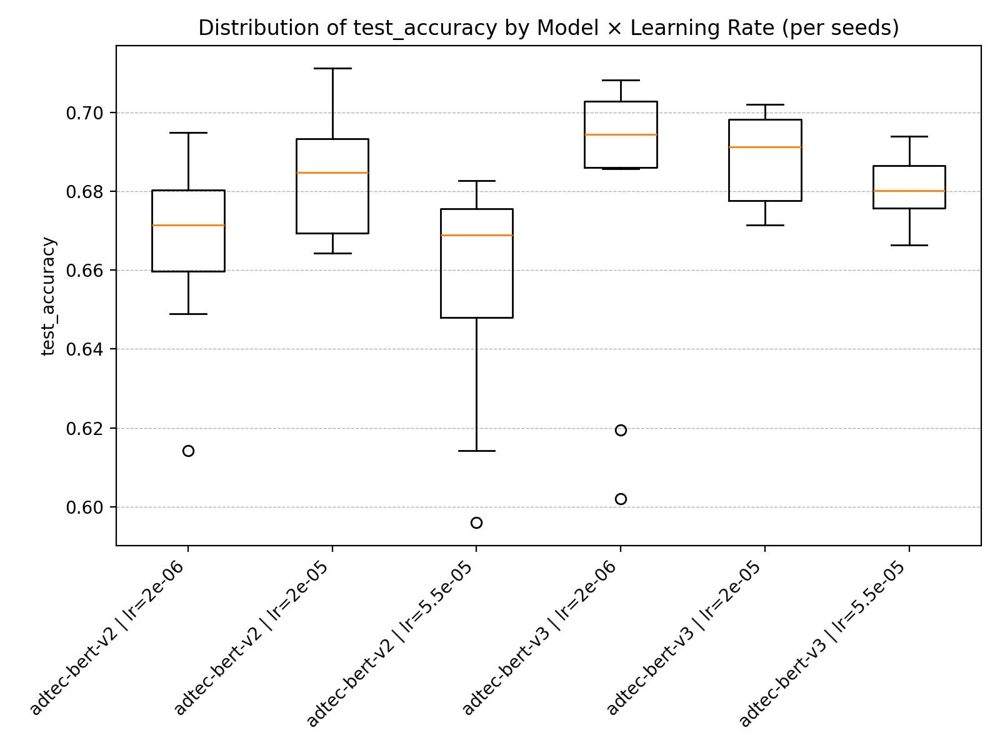
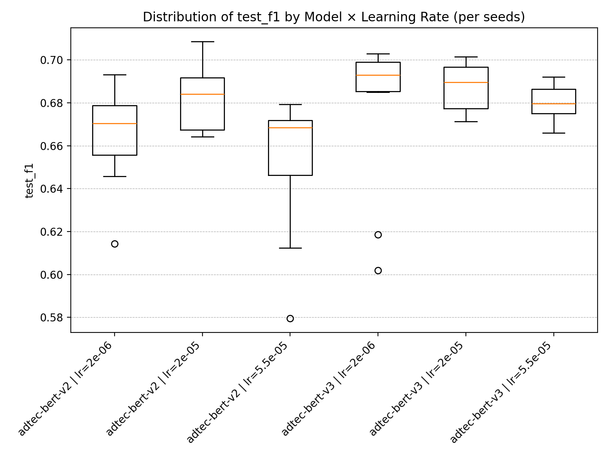

# adtecplayground

An unofficial playground for experimenting with the **AdTEC benchmark** (acceptability task).

Zhang, Peinan, Yusuke Sakai, Masato Mita, Hiroki Ouchi, and Taro Watanabe.  
“AdTEC: A Unified Benchmark for Evaluating Text Quality in Search Engine Advertising.”  
In *Proceedings of the 2025 Annual Conference of the North American Chapter of the Association for Computational Linguistics (NAACL)*.  
Association for Computational Linguistics, 2025.
- [Paper (ACL Anthology)](https://aclanthology.org/2025.naacl-long.391/)
- [Project page](https://cyberagentailab.github.io/AdTEC/)


In this repository, we re-benchmark the **Tohoku BERT v2** model with 10 different random seeds, and compare it against **Tohoku BERT v3**.

---

## Set Up Environment

```bash
pip install --upgrade pip
pip install -r requirements.txt
```

## Training

For `tohoku-nlp/bert-base-japanese-v2`:

```shell
train_v2.sh
```

For `tohoku-nlp/bert-base-japanese-v3`:

```shell
train_v3.sh
```

## Visualization

Boxplots are generated by aggregating per-seed results for each combination of model × learning rate.

```shell
# accuracy-based comparison
python adtecplayground/plot_boxplot.py test_accuracy
# F1-score-based comparison
python adtecplayground/plot_boxplot.py test_f1
```

This will produce figures such as:

- `runs/boxplot_test_accuracy.png`
- `runs/boxplot_test_f1.png`

## Results

### Test Accuracy


### Test F1


Overall, Tohoku BERT v3 generally shows more consistent performance across learning rates, often with slightly better scores. (For a rigorous statistical comparison, significance testing such as a paired *t*-test would be required 🙂)